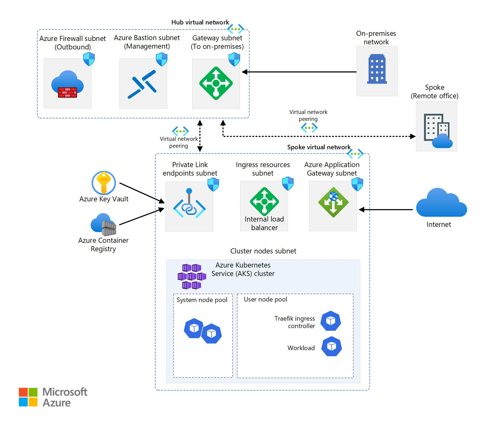
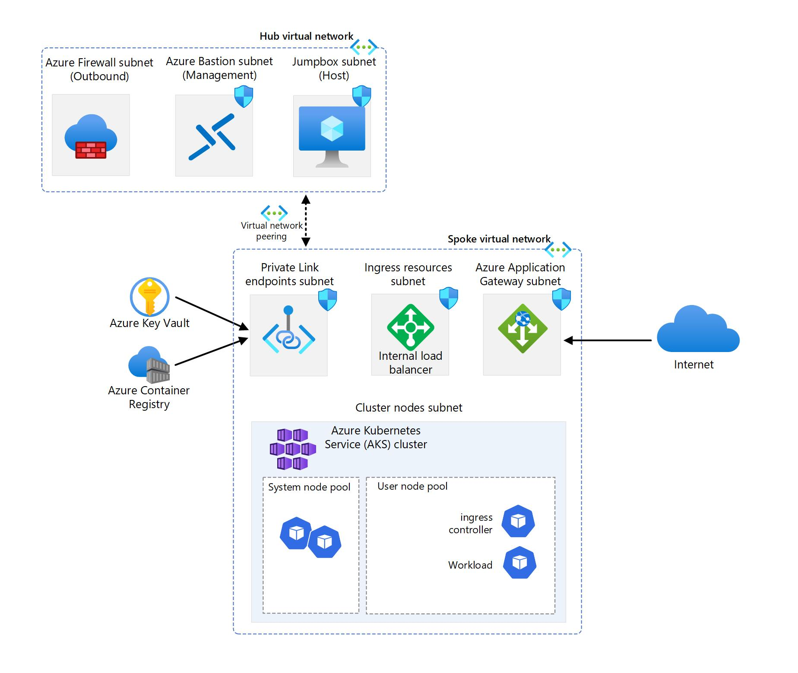

# Introduction

## 1.1 Welcome

This workshop is designed for intermediate to advanced Kubernetes users who want to improve their skills and knowledge on AKS. You will need to have some familiarity with Kubernetes concepts and tools, such as pods, services, deployments, kubectl, and Helm. You will also need to have an Azure subscription and access to a terminal or shell environment.

By the end of this workshop, you will have a deeper understanding of how to use AKS to deploy and manage a secure and scalable Kubernetes cluster on Azure. You will also have a working AKS cluster that follows the AKS secure baseline reference architecture.

## 1.2 Target Architecture

Throughout the workshop, this is the target architecture we will aim to create:
all procedures will be conducted by using Azure CLI.

