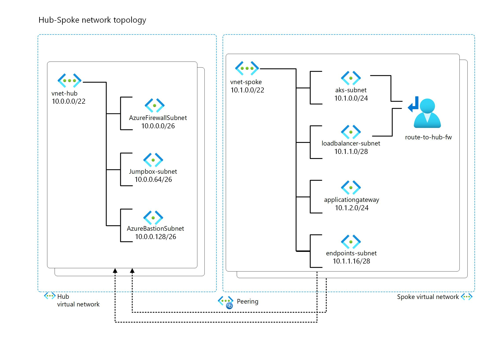

# 2 IP Planning

## 2.1 Overview

The AKS baseline is a reference architecture that provides a set of best practices and recommendations for deploying a secure and scalable Azure Kubernetes Service (AKS) cluster. One of the key components of the AKS baseline is the network design, which is divided into several subnets and virtual networks (VNets) to isolate and protect the cluster resources from external and internal threats. In this article, we will describe the purpose and configuration of each subnet and VNet in the AKS baseline, and how they work together to provide a robust network infrastructure for your AKS cluster.

## 2.2 IP Plan

IP planning is an important aspect of deploying an AKS cluster and Azure services in general, as it affects the scalability, performance, security, and availability of the cluster and its workloads. IP planning involves choosing the right network topology, IP address ranges, subnet sizes, and network policies for the cluster and its nodes, pods, and services. For more information on IP planning for an AKS cluster, see [Plan IP addressing for your cluster](https://learn.microsoft.com/en-us/azure/architecture/reference-architectures/containers/aks/baseline-aks#plan-the-ip-addresses) and [Best practices for network resources in AKS](https://learn.microsoft.com/en-us/azure/aks/operator-best-practices-network).


This is the proposed IP design that we will adhere to throughout the documentation.



> **_! Note:_**
IP planning is a crucial step that requires careful consideration of the number and size of subnets for your current solution, as well as the potential for future expansion. You should avoid using excessively large IP ranges, and instead be economical with IP and allocate only what you need for the present and the future.

Each subnet in AKS baseline has a specific purpose and configuration, further information can be found below.

### 2.2.1 Hub VNET

- **Azure Firewall Subnet**: This subnet is where the Azure Firewall is deployed. The firewall acts as an egress controller for the AKS cluster, filtering and logging the outbound traffic from the cluster to external resources or services. It also provides network address translation (NAT) functionality, which allows the cluster to access resources that are not reachable by private IP addresses. The subnet size can be small for this particular case, as it only needs to accommodate one firewall instance.

- **Azure Bastion Subnet**: This subnet is where the Azure Bastion service is deployed. Azure Bastion is a fully managed service that provides secure and seamless Remote Desktop Protocol (RDP) and Secure Shell (SSH) access to your virtual machines directly through the Azure portal⁴. This subnet is used for management and operations only, and it does not expose any resources to the internet. The subnet name must be **AzureBastionSubnet**, and the subnet size must be **/26** or larger.

- **Jump Box Subnet**: This subnet is where the jump server resides, where operation teams can login and access services in the spoke, to perform operations and maintanance.


### 2.2.2 Spoke VNET

- **Endpoints Subnet**: This subnet is where the private endpoints for Azure services are deployed. Private endpoints are a network interface that connects you privately and securely to a service powered by Azure Private Link. Private endpoints allow you to access Azure services, such as Azure Container Registry, Azure Key Vault, or Azure Storage, without exposing them to the internet or requiring a public IP address. The subnet name can be any valid name, and the subnet size depends on the number of private endpoints you need to create.

- **AKS Subnet**: This subnet is where the AKS cluster nodes are deployed. It uses Azure CNI networking, which assigns IP addresses from the subnet to each node and pod. The subnet size depends on the number of nodes and pods per node, and it should be large enough to accommodate the expected growth. The subnet also has a network security group (NSG) that controls the inbound and outbound traffic to and from the nodes.

- **Azure Application Gateway Subnet**: This subnet is where the Azure Application Gateway is deployed. The application gateway acts as an ingress controller for the AKS cluster, routing external traffic to the appropriate services or pods inside the cluster. It also provides web application firewall (WAF) functionality, which helps protect the applications from common web attacks. The subnet size can be small, as it only needs to accommodate one or more application gateway instances. The subnet also has a NSG that allows inbound traffic on ports 80 and 443, and outbound traffic to the AKS cluster.

- **Azure Application Gateway Subnet**: The load balancer subnet is a part of the network topology that supports the AKS cluster. It is where the internal load balancer (ILB) resides and assigns IP addresses to the services that are exposed within the cluster.


### 2.2.3 Prepare Environment Variables for HUB VNET and SPOKE VNET


1) Let’s use the IP plan to set up some environment variables for the Hub VNet and adjust its configuration accordingly to section 2.2 IP Plan.

````bash
HUB_VNET_NAME=Hub_VNET
FW_SUBNET_NAME=AzureFirewallSubnet
BASTION_SUBNET_NAME=AzureBastionSubnet
HUB_VNET_PREFIX= # IP address range of the Virtual network (VNet).
BASTION_SUBNET_PREFIX= # IP address range of the Bastion subnet 
FW_SUBNET_PREFIX= # IP address range of the Firewall subnet
JUMPBOX_SUBNET_PREFIX= # IP address range of the Jumpbox subnet
````
2) Configure the spoke according to section 2.2 IP Plan

````bash
SPOKE_VNET_NAME=Spoke_VNET
JUMPBOX_SUBNET_NAME=JumpboxSubnet
ENDPOINTS_SUBNET_NAME=endpoints-subnet
APPGW_SUBNET_NAME=app-gw-subnet
AKS_SUBNET_NAME=aks-subnet
LOADBALANCER_SUBNET_NAME=loadbalancer-subnet
SPOKE_VNET_PREFIX= # IP address range of the Virtual network (VNet).
AKS_SUBNET_PREFIX= # IP address range of the AKS subnet
LOADBALANCER_SUBNET_PREFIX= # IP address range of the Loadbalancer subnet
APPGW_SUBNET_PREFIX= # IP address range of the Application Gateway subnet
ENDPOINTS_SUBNET_PREFIX= # IP address range of the Endpoints subnet
````


