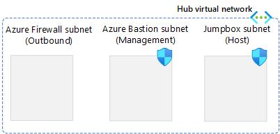

# 3.0 Deploy Infrastructure

The objective of this chapter is to guide you through the process of deploying the AKS baseline infrastructure. This infrastructure consists of the essential components and configurations that are required for running a secure and scalable AKS cluster. By following the steps in this chapter, you will be able to set up the AKS baseline infrastructure.

## 3.1 Deployment

### 3.1.1 Prepare Environment Variables for infrastructure

This configuration sets up environment variables for the names and locations of various network and security resources, such as resource group, virtual network, subnets, network security groups, firewall, application gateway, route table, identity, virtual machine, AKS cluster, and ACR registry.


````bash
RG=AKS_Security_RG
LOCATION=westeurope 
BASTION_NSG_NAME=Bastion_NSG
JUMPBOX_NSG_NAME=Jumpbox_NSG
AKS_NSG_NAME=Aks_NSG
ENDPOINTS_NSG_NAME=Endpoints_NSG
LOADBALANCER_NSG_NAME=Loadbalancer_NSG
APPGW_NSG=Appgw_NSG
FW_NAME=azure-firewall
APPGW_NAME=AppGateway
ROUTE_TABLE_NAME=spoke-rt
AKS_IDENTITY_NAME=aks-msi
JUMPBOX_VM_NAME=Jumpbox-VM
AKS_CLUSTER_NAME=private-aks
ACR_NAME=<NAME OF THE AZURE CONTAINER REGISTRY>
````
> **_! Note:_** Since the Azure container registry has a globally unique FQDN name, you need to assign a distinct value to the ACR_NAME environment variable.

### 3.1.2 Create the Resource group for the resources


````bash
az group create --name $RG --location westeurope
````

### 3.1.3 Create Network Security Groups (NSG) and Virtual Network (Vnet) for the Hub.
In this step, we will begin by establishing a Network Security Group (NSG) that will subsequently be associated with their respective subnet. It is crucial to note that there are specific prerequisites concerning security rules for certain subnets that must be met  before a service can be deployed, Azure Bastion is one of them.

For Azure Bastion, we are establishing security rules to permit both the control and data plane access to the AzureBastion. For a more detailed understanding of these rules, please refer to the following resource: [More Information](https://learn.microsoft.com/en-us/azure/bastion/bastion-nsg).

1) Lets Create the NSG for AzureBastionSubnet.
````bash
az network nsg create \
    --resource-group $RG \
    --name $BASTION_NSG_NAME \
    --location $LOCATION
````

2) Associate the required **inbound** security rules to the NSG.
````bash
    az network nsg rule create --name AllowHttpsInbound \
    --nsg-name $BASTION_NSG_NAME --priority 120 --resource-group $RG\
    --access Allow --protocol TCP --direction Inbound \
    --source-address-prefixes "Internet" \
    --source-port-ranges "*" \
    --destination-address-prefixes "*" \
    --destination-port-ranges "443"
	
   	az network nsg rule create --name AllowGatewayManagerInbound \
    --nsg-name $BASTION_NSG_NAME --priority 130 --resource-group $RG\
    --access Allow --protocol TCP --direction Inbound \
    --source-address-prefixes "GatewayManager" \
    --source-port-ranges "*" \
    --destination-address-prefixes "*" \
    --destination-port-ranges "443"
	
	az network nsg rule create --name AllowAzureLoadBalancerInbound \
    --nsg-name $BASTION_NSG_NAME --priority 140 --resource-group $RG\
    --access Allow --protocol TCP --direction Inbound \
    --source-address-prefixes "AzureLoadBalancer" \
    --source-port-ranges "*" \
    --destination-address-prefixes "*" \
    --destination-port-ranges "443"
	
	
	az network nsg rule create --name AllowBastionHostCommunication \
    --nsg-name $BASTION_NSG_NAME --priority 150 --resource-group $RG\
    --access Allow --protocol TCP --direction Inbound \
    --source-address-prefixes "VirtualNetwork" \
    --source-port-ranges "*" \
    --destination-address-prefixes "VirtualNetwork" \
    --destination-port-ranges 8080 5701
````

3) Associate the required **outbound** security rules to the NSG.

````bash
    az network nsg rule create --name AllowSshRdpOutbound \
    --nsg-name $BASTION_NSG_NAME --priority 100 --resource-group $RG\
    --access Allow --protocol "*" --direction outbound \
    --source-address-prefixes "*" \
    --source-port-ranges "*" \
    --destination-address-prefixes "VirtualNetwork" \
    --destination-port-ranges 22 3389
	
    az network nsg rule create --name AllowAzureCloudOutbound \
    --nsg-name $BASTION_NSG_NAME --priority 110 --resource-group $RG\
    --access Allow --protocol Tcp --direction outbound \
    --source-address-prefixes "*" \
    --source-port-ranges "*" \
    --destination-address-prefixes "AzureCloud" \
    --destination-port-ranges 443
	
	az network nsg rule create --name AllowBastionCommunication \
    --nsg-name $BASTION_NSG_NAME --priority 120 --resource-group $RG\
    --access Allow --protocol "*" --direction outbound \
    --source-address-prefixes "VirtualNetwork" \
    --source-port-ranges "*" \
    --destination-address-prefixes "VirtualNetwork" \
    --destination-port-ranges 8080 5701
	
	az network nsg rule create --name AllowHttpOutbound \
    --nsg-name $BASTION_NSG_NAME --priority 130 --resource-group $RG\
    --access Allow --protocol "*" --direction outbound \
    --source-address-prefixes "*" \
    --source-port-ranges "*" \
    --destination-address-prefixes "Internet" \
    --destination-port-ranges 80
````

4) Create an NSG for the JumpBox subnet.

````bash
az network nsg create \
    --resource-group $RG \
    --name $JUMPBOX_NSG_NAME \
    --location $LOCATION
````
5) Create the HUB VNET with one subnet for **Azure Bastion Subnet** and associate it to the bastion NSG.

````bash
az network vnet create \
    --resource-group $RG  \
    --name $HUB_VNET_NAME \
    --address-prefixes $HUB_VNET_PREFIX \
    --subnet-name $BASTION_SUBNET_NAME \
    --subnet-prefixes $BASTION_SUBNET_PREFIX \
    --network-security-group $BASTION_NSG_NAME
````
6) Create a subnet for the Azure Firewall.


````bash
az network vnet subnet create \
    --resource-group $RG  \
    --vnet-name $HUB_VNET_NAME \
    --name $FW_SUBNET_NAME \
    --address-prefixes $FW_SUBNET_PREFIX
````

7) Create a subnet for the Virtual Machine that will be used as "jumpbox".

````bash
az network vnet subnet create \
    --resource-group $RG  \
    --vnet-name $HUB_VNET_NAME \
    --name $JUMPBOX_SUBNET_NAME \
    --address-prefixes $JUMPBOX_SUBNET_PREFIX \
    --network-security-group $JUMPBOX_NSG_NAME
````
You have successfully configured the network for your hub virtual network.You have established three subnets and two NSGs, as depicted on the image:



### 3.1.4 Create Network Security Groups and Virtual Network for the Spoke.
We will now start to setup the spoke vnet, subnets and their respective NSGs,

1) Create the NSG for AKS subnet.
````bash
az network nsg create \
    --resource-group $RG \
    --name $AKS_NSG_NAME \
    --location $LOCATION
````
2) Create the NSG for endpoints subnet, were the endpoints will reside.
````bash
az network nsg create \
    --resource-group $RG \
    --name $ENDPOINTS_NSG_NAME \
    --location $LOCATION
````
3) Create the NSG for load balancer subnet, were the internal load balancer will reside.
````bash
az network nsg create \
    --resource-group $RG \
    --name $LOADBALANCER_NSG_NAME \
    --location $LOCATION
````
4) To use an NSG with your application gateway, you need to open these port ranges:

Inbound rules: The **Internet service tag** needs access to port **65200-65535** for the backend health API. Your application traffic needs access to TCP port **80 and/or 443**. for futher information refer to [Required security rules for Application Gateway](https://learn.microsoft.com/en-us/azure/application-gateway/configuration-infrastructure#required-security-rules) for more information.
````bash
az network nsg create \
    --resource-group $RG \
    --name $APPGW_NSG \
    --location $LOCATION
````
5) Create the NSG rule to allow application traffic, on port 443 and 80.

````bash
# Allow Internet Client request on Port 443 and 80
az network nsg rule create \
    --resource-group $RG \
    --nsg-name $APPGW_NSG \
    --name Allow-Internet-Inbound-HTTP-HTTPS \
    --priority 100 \
    --source-address-prefixes Internet \
    --destination-port-ranges 80 443 \
    --access Allow \
    --protocol Tcp \
    --description "Allow inbound traffic to port 80 and 443 to Application Gateway from client requests originating from the Internet"
````
5) Create the NSG rule to allow application traffic, on port 443 and 80.
````bash
# Infrastructure ports
az network nsg rule create \
    --resource-group $RG \
    --nsg-name $APPGW_NSG \
    --name Allow-GatewayManager-Inbound \
    --priority 110 \
    --source-address-prefixes "GatewayManager" \
    --destination-port-ranges 65200-65535 \
    --access Allow \
    --protocol Tcp \
    --description "Allow inbound traffic to ports 65200-65535 from GatewayManager service tag"
````
6) Create the spoke VNET with one subnet for **AKS Subnet** and associate it to the AKS NSG.

````bash
az network vnet create \
    --resource-group $RG  \
    --name $SPOKE_VNET_NAME \
    --address-prefixes $SPOKE_VNET_PREFIX \
    --subnet-name $AKS_SUBNET_NAME \
    --subnet-prefixes $AKS_SUBNET_PREFIX \
	--network-security-group $AKS_NSG_NAME
````

7) Create the subnet for **Endpoints** and associate it to the endpoints NSG.

````bash
az network vnet subnet create \
    --resource-group $RG  \
    --vnet-name $SPOKE_VNET_NAME  \
    --name $ENDPOINTS_SUBNET_NAME \
    --address-prefixes $ENDPOINTS_SUBNET_PREFIX \
	--network-security-group $ENDPOINTS_NSG_NAME
````
8) Create subnet for the **load balancer** that will be used for ingress traffic and associate it to the loadbalancer NSG.

````bash
az network vnet subnet create \
    --resource-group $RG  \
    --vnet-name $SPOKE_VNET_NAME \
    --name $LOADBALANCER_SUBNET_NAME \
    --address-prefixes $LOADBALANCER_SUBNET_PREFIX \
	--network-security-group $LOADBALANCER_NSG_NAME
````

9) Create subnet for the **Application Gateway** and associate it to the Application Gateway NSG.

````bash
az network vnet subnet create \
    --resource-group $RG  \
    --vnet-name $SPOKE_VNET_NAME \
    --name $APPGW_SUBNET_NAME \
    --address-prefixes $APPGW_SUBNET_PREFIX \
	--network-security-group $APPGW_NSG
````
You have successfully configured the network for your spoke virtual network. You should now have established the following setup in your Azure subscription.


### 3.1.5 Create Vnet peering between hub and spoke

The next step is to create a virtual network peering between the hub and spoke VNets. This will enable the communication between the VNets and allow the AKS cluster to route traffic to the Firewall.

1) Create a peering connection from the hub to spoke virtual networks.

````bash
az network vnet peering create \
    --resource-group $RG  \
    --name hub-to-spoke \
    --vnet-name $HUB_VNET_NAME \
    --remote-vnet $SPOKE_VNET_NAME \
    --allow-vnet-access
````

2) Create a peering connection from  the spoke to hub virtual networks.

````bash
az network vnet peering create \
    --resource-group $RG  \
    --name spoke-to-hub \
    --vnet-name $SPOKE_VNET_NAME \
    --remote-vnet $HUB_VNET_NAME \
    --allow-vnet-access
````
Peering should be established and the high level design should now look like this.


### 3.1.6 Create Azure Bastion and Jumpbox VM

1) Create a public IP address for the bastion host

````bash
az network public-ip create \
    --resource-group $RG  \
    --name Bastion-PIP \
    --sku Standard \
    --allocation-method Static
````
2) Create JumpBox Virtual Machine.

> **_! Note:_**  Ensure you specify a **password** for the admin user called **azureuser**.

````bash
az vm create \
    --resource-group $RG \
    --name $JUMPBOX_VM_NAME \
    --image Ubuntu2204 \
    --admin-username azureuser \
    --admin-password <SPECIFY A PASSWORD HERE> \
    --vnet-name $HUB_VNET_NAME \
    --subnet $JUMPBOX_SUBNET_NAME \
    --size Standard_B2s \
    --storage-sku Standard_LRS \
    --os-disk-name $JUMPBOX_VM_NAME-VM-osdisk \
    --os-disk-size-gb 128 \
    --public-ip-address "" \
    --nsg ""  
  
````
3) The following script will deploy, Azure CLI, Docker and kubelet onto the Virtual machine.

````bash
az vm extension set --resource-group $RG --vm-name $JUMPBOX_VM_NAME --name customScript --publisher Microsoft.Azure.Extensions --version 2.0 --settings "{\"fileUris\":[\"https://raw.githubusercontent.com/abengtss-max/simple_aks/main/install.sh\"]}" --protected-settings "{\"commandToExecute\": \"sh install.sh\"}"
````
4) Create the bastion host in hub vnet and associate it to the public IP.
> **_! Note:_**  Azure Bastion service requires a dedicated subnet named **AzureBastionSubnet** to provide secure and seamless RDP/SSH connectivity to your virtual machines. When you deploy Azure Bastion service, it will automatically create this subnet for you, if it does not exist in the target virtual network. However, if the subnet already exists, it must meet the minimum size of **/26** or larger, otherwise the deployment will fail.

````bash
az network bastion create \
    --resource-group $RG \
    --name bastionhost \
    --public-ip-address Bastion-PIP \
    --vnet-name $HUB_VNET_NAME \
    --location westeurope
````
5) Connect to VM using the portal:

Upon successful installation of the Jumpbox Virtual Machine (VM), the next step is to validate the connectivity between the Bastion and Jumpbox host. Here are the steps to follow:

5.1) Navigate to the Azure portal at [https://portal.azure.com](https://portal.azure.com) and enter your login credentials.

5.2) Once logged in, locate and select your **resource group** where the Jumpbox has been deployed.

5.3) Within your resource group, find and click on the **Jumpbox VM**.

5.4) In the left-hand side menu, under the **Operations** section, select ‘Bastion’.

5.5) Enter the **credentials** for the Jumpbox VM and verify that you can log in successfully. 

For additional information on accessing VMs through Bastion, please refer to this [Microsoft Azure Bastion tutorial](https://learn.microsoft.com/en-us/azure/bastion/create-host-cli#steps)

After completed these steps, The high-level targeted architecture now matches the following diagram:


### 3.1.7 Create an Azure Firewall and setup a UDR

To secure your AKS outbound traffic, you need to follow these steps for a basic cluster deployment. These steps will help you restrict the outbound access and to certain FQDNs that are needed by the cluster. further information can be found here: [Control egress traffic using Azure Firewall in Azure Kubernetes Service (AKS)](https://learn.microsoft.com/en-us/azure/aks/limit-egress-traffic)

1) Create Azure Firewall, and deploy it to it to firewall subnet in hub vnet.
````bash
az network firewall create \
    --resource-group $RG \
    --name $FW_NAME \
    --location westeurope \
    --vnet-name $HUB_VNET_NAME \
    --enable-dns-proxy true

````
2) Create the Public IP address resource.

````bash
az network public-ip create \
    --name fw-pip \
    --resource-group $RG \
    --location westeurope \
    --allocation-method static \
    --sku standard

````

3) Associate the public IP address with the Firewall.

````bash
az network firewall ip-config create \
    --firewall-name $FW_NAME \
    --name FW-config \
    --public-ip-address fw-pip \
    --resource-group $RG \
    --vnet-name $HUB_VNET_NAME

````
4) Update the existing Azure Firewall configuration.

````bash
az network firewall update \
    --name $FW_NAME \
    --resource-group $RG 
````
5) Create Network rules in Azure Firewall
 
The following network rules allows outbound traffic from any source address to certain destinations and ports. If the required destionation is not specified the AKS cluster will fail to deploy.

````bash
az network firewall network-rule create -g $RG -f $FW_NAME --collection-name 'aksfwnr' -n 'apiudp' --protocols 'UDP' --source-addresses '*' --destination-addresses "AzureCloud.$LOCATION" --destination-ports 1194 --action allow --priority 100
````
````bash
az network firewall network-rule create -g $RG -f $FW_NAME --collection-name 'aksfwnr' -n 'apitcp' --protocols 'TCP' --source-addresses '*' --destination-addresses "AzureCloud.$LOCATION" --destination-ports 9000
````
````bash
az network firewall network-rule create -g $RG -f $FW_NAME --collection-name 'aksfwnr' -n 'time' --protocols 'UDP' --source-addresses '*' --destination-fqdns 'ntp.ubuntu.com' --destination-ports 123
````
6) Create Azure Firewall application rule

This rules specifies the FQDN's which are required by AKS, **AzureKubernetesService** tag which include all the FQDNs listed in Outbound network and FQDN rules for AKS clusters.

````bash
az network firewall application-rule create -g $RG -f $FW_NAME --collection-name 'aksfwar' -n 'fqdn' --source-addresses '*' --protocols 'http=80' 'https=443' --fqdn-tags "AzureKubernetesService" --action allow --priority 100
````

7) Create a route table
````bash
az network route-table create \
    --resource-group $RG  \
    --name $ROUTE_TABLE_NAME

````

8) Create a route to the internet via the Azure Firewall

In order to create the route we need to obtain the private IP address of the Firewall.To get the private IP address of the Firewall, you need to run the following command and store the output in an environment variable.

````bash
 fw_private_ip=$(az network firewall show \
    --resource-group $RG \
    --name $FW_NAME \
    --query 'ipConfigurations[0].privateIpAddress' \
    --output tsv)
````
To get the private IP address of the Firewall, you need to run the following command and store the output in an environment variable.
````bash
az network route-table route create \
    --resource-group $RG  \
    --name default-route \
    --route-table-name $ROUTE_TABLE_NAME \
    --address-prefix 0.0.0.0/0 \
    --next-hop-type VirtualAppliance \
    --next-hop-ip-address $fw_private_ip

````
> **_! Note:_** The route will direct all traffic (0.0.0.0/0) to the next hop type of VirtualAppliance, which is the firewall instance. The next hop IP address is the private IP address of the firewall, which is stored in the environment variable $FW_PRIVATE_IP. This way, the traffic from the AKS subnet will be routed to the firewall instance on its private endpoint. This will allow you to perform inspection on outbound traffic.

9) Associate the route table with the AKS subnet.

````bash
az network vnet subnet update \
    --resource-group $RG  \
    --vnet-name $SPOKE_VNET_NAME \
    --name $AKS_SUBNET_NAME \
    --route-table $ROUTE_TABLE_NAME
````
You have successfully configured the firewall in hub vnet.


### 3.1.6 Deploy Azure Kubernetes Service

In this chapter, we will learn how to deploy AKS and configure its outbound traffic to use the user-defined routing table that we created in the previous chapter. By doing this, we will ensure that all outbound traffic from the AKS subnet will pass through the Azure Firewall for inspection and filtering. Since we are deploying AKS into an existing virtual network, we need to assign an identity to the cluster that has the necessary permissions to modify the routing table. This identity is called a user assigned identity and it is a type of managed identity in Azure. we will also need to assign the user managed identity to the load balancer subnet, as AKS will need permissions to update load balancer with rules. We will see how to create and assign this identity in the following steps.

1) Create a user-assigned managed identity
````bash
az identity create \
    --resource-group $RG \
    --name $AKS_IDENTITY_NAME
````
2) Get the id of the user managed identity
````bash
 identity_id=$(az identity show \
    --resource-group $RG \
    --name $AKS_IDENTITY_NAME \
    --query id \
    --output tsv)
````
3) Get the principal id of the user managed identity

````bash
principal_id=$(az identity show \
    --resource-group $RG \
    --name $AKS_IDENTITY_NAME \
    --query principalId \
    --output tsv)
````

4) Get the scope of the routing table

````bash
rt_scope=$(az network route-table show \
    --resource-group $RG \
    --name $ROUTE_TABLE_NAME  \
    --query id \
    --output tsv)
````
5) Assign permissions for the AKS user defined managed identity to the routing table

````bash
az role assignment create \
    --assignee $principal_id \
    --scope $rt_scope \
    --role "Network Contributor"
````

6) Assign permission for the AKS user defined managed identity to the load balancer subnet

````bash
lb_subnet_scope=$(az network vnet subnet list \
    --resource-group $RG \
    --vnet-name $SPOKE_VNET_NAME \
    --query "[?name=='$LOADBALANCER_SUBNET_NAME'].id" \
    --output tsv)
````

````bash
az role assignment create \
    --assignee $principal_id \
    --scope $lb_subnet_scope \
    --role "Network Contributor"

````
> **_! Note:_**
In the context of Azure Kubernetes Service (AKS), granting the Network Contributor role to the load balancer subnet could potentially result in over-privileged access. To adhere to the principle of least privilege access, it is recommended to only provide AKS with the necessary permissions it needs to function effectively. This approach minimizes potential security risks by limiting the access rights of AKS to the bare minimum required for it to perform its tasks. For more information refer to [Creating Azure custom role](./docs/customrole.md)

7) Retrieve the scope of AKS subnet, were AKS shall be deployed.

````bash
aks_subnet_scope=$(az network vnet subnet list \
    --resource-group $RG \
    --vnet-name $SPOKE_VNET_NAME \
    --query "[?name=='$AKS_SUBNET_NAME'].id" \
    --output tsv)
````
8) Deploy a Private AKS cluster.

````bash
az aks create --resource-group $RG --node-count 3 --vnet-subnet-id $aks_subnet_scope --name $AKS_CLUSTER_NAME --enable-private-cluster --outbound-type userDefinedRouting --enable-oidc-issuer --enable-workload-identity --generate-ssh-keys --assign-identity $identity_id
````

> **_! Note:_** A private AKS cluster is a type of AKS cluster that has its Kubernetes API endpoint isolated from public access. This means that you can only access the API endpoint if you are within the same virtual network as the cluster. However, in our scenario, we have our jumpbox in a different virtual network than the cluster. Therefore, we need to create a virtual network link between the two networks to enable DNS resolution across them. This will allow us to use the jumpbox to communicate with the private AKS cluster. We will see how to create and configure this link in the next section.

9) Create a virtual network link to resolve AKS private endpoint from HUB vnet.

Fetch the node group of the AKS cluster, and save it in an environment variable.
````bash
NODE_GROUP=$(az aks show --resource-group $RG --name $AKS_CLUSTER_NAME --query nodeResourceGroup -o tsv)
````
Fetch the AKS DNS zone name.
````bash
DNS_ZONE_NAME=$(az network private-dns zone list --resource-group $NODE_GROUP --query "[0].name" -o tsv)

````
Fetch the ID of the HUB virtual network.
````bash
HUB_VNET_ID=$(az network vnet show -g $RG -n $HUB_VNET_NAME --query id --output tsv)
````
Create a virtual network link between the hub virtual network and the AKS private DNS zone.
that was created for the AKS cluster.
````bash
az network private-dns link vnet create --name "hubnetdnsconfig" --registration-enabled false --resource-group $NODE_GROUP --virtual-network $HUB_VNET_ID --zone-name $DNS_ZONE_NAME 
````

10) Verify AKS control plane connectivity

In this section we will verify that we are able to connect to the AKS cluster from the jumpbox, firstly we need to connect to the cluster successfully and secondly we need to verify that the kubernetes client is able to communicate with the AKS control plane from the jumpbox. 

10.1) Navigate to the Azure portal at **portal.azure.com** and enter your login credentials.

10.2) Once logged in, locate and select your **resource group** where the Jumpbox has been deployed.

10.3) Within your resource group, find and click on the **Jumpbox VM**.

10.4) In the left-hand side menu, under the **Operations** section, select ‘Bastion’.

10.5) Enter the **credentials** for the Jumpbox VM and verify that you can log in successfully.

10.6) Once successfully logged in to the jumbox **login to Azure** in order to obtain AKS credentials.

````bash
sudo az login
sudo az account set --subscription <SUBSCRIPTION ID>
````
> **_! Note:_**
To check the current subscription, run the command: **az account show**
To change the subscription, run the command: **az account set --subscription <SUBSCRIPTION ID>, where <SUBSCRIPTION ID>** the ID of the desired subscription. You can find the subscription ID by running the command: **az account list --output table**

10.7) Download the AKS credentials onto the jumpbox.

````bash
sudo az aks get-credentials --resource-group $RG --name $AKS_CLUSTER_NAME
````
10.8) Ensure you can list resources in AKS.

````bash
sudo kubectl get nodes
````

The following output shows the result of running the command kubectl get nodes on with kubectl CLI.

````bash
azureuser@Jumpbox-VM:~$ sudo kubectl get nodes
NAME                                STATUS   ROLES   AGE   VERSION
aks-nodepool1-33590162-vmss000000   Ready    agent   11h   v1.26.6
aks-nodepool1-33590162-vmss000001   Ready    agent   11h   v1.26.6
aks-nodepool1-33590162-vmss000002   Ready    agent   11h   v1.26.6
````

Congratulations! You have completed the steps to deploy a private AKS cluster and configure its network settings. You have assigned a user assigned identity to the cluster that has the required permissions to modify the user-defined routing table and load balancer subnet. You have also created a virtual network link between the hub virtual network and the private DNS zone of the cluster. This enables the jumpbox to resolve the private API server of the cluster and access it for management and maintenance purposes.


